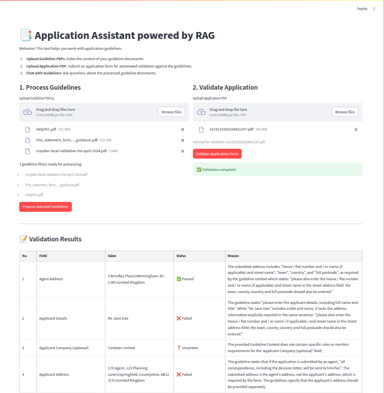
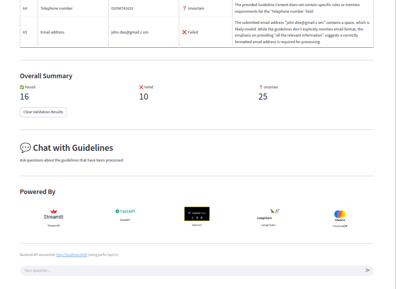

# RAG Application Assistant

This project implements a Retrieval Augmented Generation (RAG) system to assist with understanding and validating application forms against a set of guideline documents. This project used different tools across every layer:
* **User Interface**:  I chose Streamlit to craft a sleek, interactive dashboard - no boilerplate UI code required.
* **API Layer**:  Behind the scenes, FastAPI powers the endpoints
* **Large Language Models**: For natural-language generation and embedding, I tapped into Google Gemini:
   - gemini-1.5-flash for fast, high-quality text generation
   - models/text-embedding-004 to convert text into vector embeddings
* **Orchestration & Utilities**: LangChain used to stitch everything together.. Leveraging its text-splitter utilities to break PDFs into digestible chunks, and layer the service logic for custom workflows.
* **Vector Database**:  All embeddings are stored in ChromaDB, giving a lightning-fast similarity search and retrieval.
* **PDF Extraction**: I relied on pypdf (PyPDF2) to pull raw text out of PDFs, so that the LLM pipeline always has clean inputs.
* **Programming Language**: The entire codebase is written in Python, keeping our development both flexible and familiar.



And here are the results and chat section:




## Features

* **Guideline Processing**: Upload PDF guideline documents. The backend extracts text, chunks it, generates embeddings, and stores them in a ChromaDB vector store.
* **Application Validation**: Upload an application form (PDF). The backend extracts structured data from the form using an LLM, then validates each field against the indexed guidelines using a RAG approach with an LLM. Results are formatted for readability.
* **Chat with Guidelines**: Interact with a chatbot that answers questions based on the content of the processed guideline documents.
* **Modular Backend**: FastAPI backend structured with services, routers, schemas, and utilities for better maintainability.
* **Clear Frontend-Backend Separation**: Streamlit UI communicates with the FastAPI backend via HTTP requests.

## Project Structure
```text
rag_application_assistant/
├── backend/
│   ├── app/
│   │   ├── init.py
│   │   ├── main.py             # FastAPI app instantiation, include routers
│   │   ├── api/
│   │   │   ├── init.py
│   │   │   └── endpoints.py    # FastAPI routers and endpoint logic
│   │   ├── services/
│   │   │   ├── init.py
│   │   │   ├── llm_service.py    # Gemini model interactions
│   │   │   ├── vector_store_service.py # ChromaDB interactions
│   │   │   └── document_processor_service.py # Orchestration logic
│   │   ├── schemas/
│   │   │   ├── init.py
│   │   │   └── models.py       # Pydantic models
│   │   ├── core/
│   │   │   ├── init.py
│   │   │   └── config.py       # Configuration variables
│   │   └── utils/
│   │       ├── init.py
│   │       └── file_processing.py # PDF extraction, text chunking
│   └── requirements.txt        # Backend dependencies
├── frontend/
│   ├── app.py                  # Streamlit application
│   ├── requirements.txt        # Frontend dependencies
|   └── images                  # Images on the app frontend
├── data/                       # (To be created by user for local testing if desired)
│   ├── guidance/
│   └── pre_submitted_form/
├── vector_store/               # (Created by backend for ChromaDB persistence)
│   └── chroma_db/
├── .gitignore                  # (Recommended: add venv.)
└── README.md
```

## Prerequisites

* Python 3.8+
* Google Cloud Project with the Generative Language API (Gemini) enabled.
* A `GOOGLE_API_KEY` environment variable set with your API key.

## Setup and Installation
First, let’s install uv and set up our Python project and environment:
1. **Install uv**
   ```MacOS/Linux
    curl -LsSf https://astral.sh/uv/install.sh | sh
    ```
2.  **Clone the repository:**
    ```bash
    git clone [this Repo](https://github.com/anthonymalumbe/llm_products)
    cd rag_application_assistant
    ```

3.  **Create and activate a virtual environment (recommended):**

    ```MacOS/Linux
    # Create a new directory for our project
    uv init rag_application_assistant
    cd rag_application_assistant
    
    # Create virtual environment and activate it
    uv venv
    source .venv/bin/activate    
    ```

4.  **Create necessary data directories (optional, for local file persistence if backend saves them):**
    ```bash
    mkdir -p ./data/guidance ./data/pre_submitted_form
    ```
    The `./vector_store/chroma_db/` directory will be created automatically by the backend.

5.  **Set your Google API Key:**
    * Ensure you create a .env file and add your google api key `GOOGLE_API_KEY='YOUR_API_KEY'`
    * Ensure the `GOOGLE_API_KEY` environment variable is set. Refer to your OS documentation.
    * Example (Linux/macOS): `export GOOGLE_API_KEY='YOUR_API_KEY'`

6.  **Install dependencies:**
    * **For the backend:**
        ```bash
        cd backend
        pip install -r requirements.txt
        or
        uv add fastapi uvicorn[standard] pydantic python-dotenv google-generativeai google-api-core chromadb pypdf pypdf2 tqdm langchain-text-splitters sentence-transformers python-multipart cryptography 
        cd ..
        ```
    * **For the frontend:**
        ```bash
        cd frontend
        pip install -r requirements.txt
        or uv add streamlit requests pandas
        cd ..
        ```

## Running the Application

You need to run the backend (FastAPI) and the frontend (Streamlit) separately, typically in two different terminal sessions (with the virtual environment activated in both).

### 1. Run the Backend (FastAPI)

Navigate to the `backend` directory:
```bash
cd backend
uvicorn backend.app.main:app --reload --host 0.0.0.0 --port 8000

The backend API will be available at http://localhost:8000. The endpoints are prefixed with /api/v1/.
```

### 2. Run the Frontend (Streamlit)

Navigate to the `frontend` directory:
```bash
cd frontend
streamlit run app.py
```

*The Streamlit application will typically open in your web browser automatically (e.g., http://localhost:8501). It is configured to communicate with the backend at http://localhost:8000.*

*If your backend runs on a different URL/port, set the BACKEND_URL environment variable before running Streamlit:*

```bash
# Example for Linux/macOS
export BACKEND_URL='http://your-custom-backend-url:port'
streamlit run app.py
```

## Usage
1. Open the **Streamlit application** in your browser.
2. The **frontend will attempt to connect to the backend.
3. **Upload Guideline PDFs**: In the "Process Guidelines" section, upload PDF files. Click "Process Selected Guidelines".
4. **Upload Application PDF**: Once guidelines are processed, upload an application PDF in the "Validate Application" section. Click "Validate Application Form".
5. **View Validation Results**: The validation summary will be displayed.
6. **Chat with Guidelines**: Use the chat interface to ask questions about the processed guidelines.

## Key Configuration
1. **Backend**: Most configurations (API keys, model names, paths) are in backend/app/core/config.py. Many can be overridden by environment variables.
2. **Frontend**: The BACKEND_URL for the API is configured in frontend/app.py and can be overridden by an environment variable.

---
